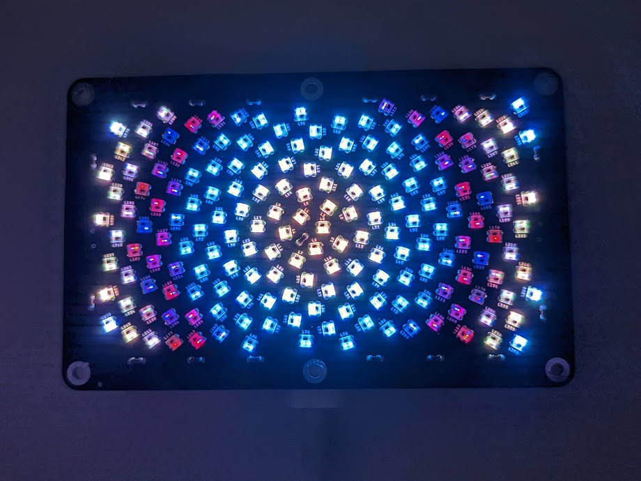

# Fibonacci182 Card Touch Demo

Demo Arduino firmware for Fibonacci182 Card with touch pads

More information: [https://evilgeniuslabs.org/fibonacci128-card](https://evilgeniuslabs.org/fibonacci128-card)

### Dependencies

I developed and tested this sketch with the following board and library versions. The sketch may work with other versions, but these are known to work.

Board: Adafruit QT Py (SAMD21) 
* Adafruit SAMD Boards version 1.7.5
* https://adafruit.github.io/arduino-board-index/package_adafruit_index.json

Libraries:
* FastLED v3.5.0: https://github.com/FastLED/FastLED
* Adafruit FreeTouch Library v1.1.1: https://github.com/adafruit/Adafruit_FreeTouch